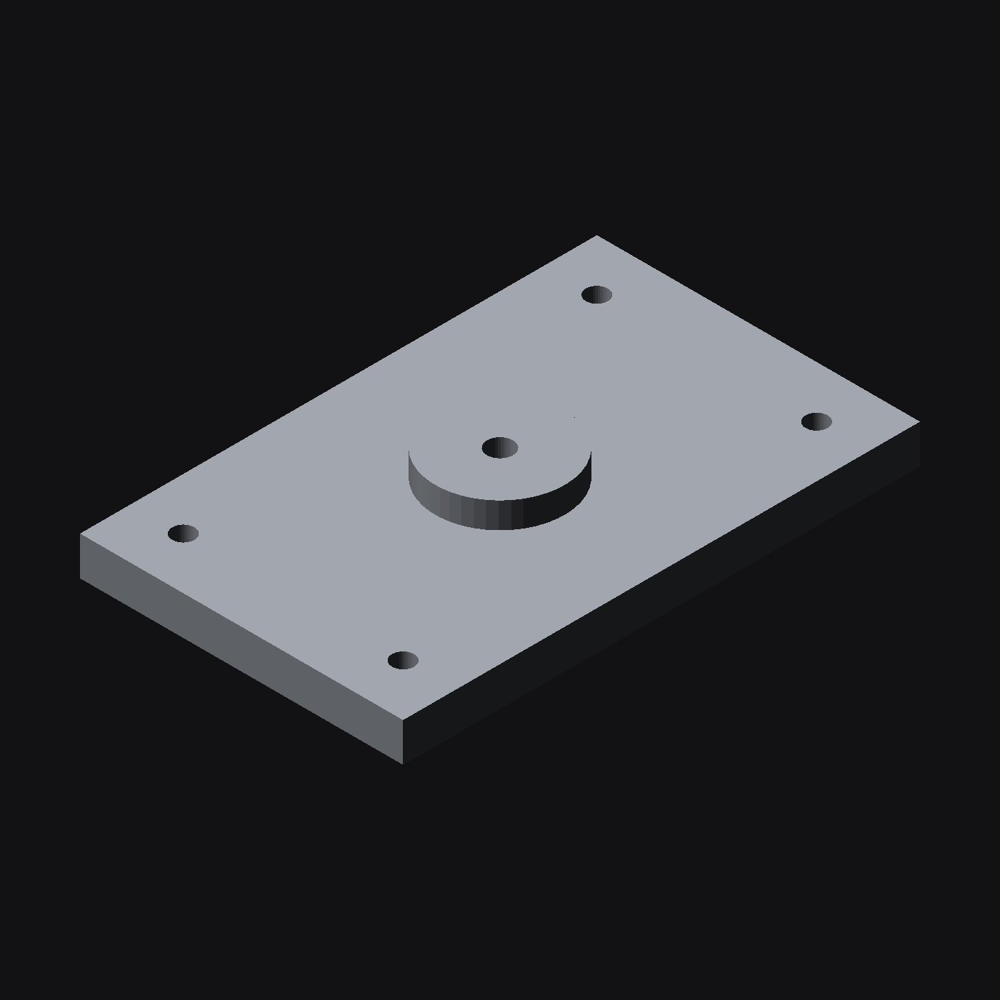

# claude-cad-workbench

Skills, a CAD agent and a self-checking example for designing 3D-printable
parts with **Claude Code**, **FreeCAD** and **GIMP**.

The idea in one line: Claude writes the CAD as *code*, runs it headless, and the
code **fails loudly** when the geometry is wrong — so "it exported without an
error" is never the bar.

**New here? Start with the [step-by-step tutorial](docs/tutorial/README.md)**: twelve short parts, each ending in a check you can run and
a link to the next, from the first headless command to taking a drawing to a rigged glTF.

The long version, in a single read, is the blog post: *Setting up FreeCAD, GIMP and Claude to design 3D models*
(<https://dlockamy.com/blog/>).



## Quick start

```sh
git clone https://github.com/dlockamy/claude-cad-workbench && cd claude-cad-workbench

./install.sh          # symlink the skills + agent into ~/.claude
./tools/doctor.sh     # read-only: what's installed, what's missing

# Prove the headless path works — no bridge, no GUI needed:
freecadcmd examples/mount-plate/mount_plate.py          # all checks pass, exit 0
MOUNT_PLATE_BREAK=1 freecadcmd examples/mount-plate/mount_plate.py   # must FAIL, exit 1
```

On macOS `freecadcmd` is at
`/Applications/FreeCAD.app/Contents/Resources/bin/freecadcmd`.

`install.sh` only ever replaces symlinks it created; it skips anything else
and tells you. `./install.sh --uninstall` removes exactly what it added.

Prefer not to touch `~/.claude`? The repo is also a Claude Code plugin
(`claude plugin validate .` passes):
`claude --plugin-dir /path/to/claude-cad-workbench` loads the skills and agent
for that session only.

## The tutorial

Twelve short parts; each links to the next, so you can read straight through. [Start with part 1](docs/tutorial/01-the-idea-and-the-first-check.md).

| Part | |
|---|---|
| [1](docs/tutorial/01-the-idea-and-the-first-check.md) | The idea, and the first check |
| [2](docs/tutorial/02-install-the-tools.md) | Install the tools |
| [3](docs/tutorial/03-write-a-part-that-checks-itself.md) | Write a part that checks itself |
| [4](docs/tutorial/04-make-it-fail-on-purpose.md) | Make it fail on purpose |
| [5](docs/tutorial/05-look-at-the-part.md) | Look at the part, and check your checker |
| [6](docs/tutorial/06-teach-claude-the-house-rules.md) | Teach Claude the house rules |
| [7](docs/tutorial/07-the-gimp-bridge.md) | The GIMP bridge |
| [8](docs/tutorial/08-freecads-live-bridge.md) | FreeCAD's live bridge |
| [9](docs/tutorial/09-prove-a-bridge-before-you-trust-it.md) | Prove a bridge before you trust it |
| [10](docs/tutorial/10-what-this-cannot-tell-you.md) | What this setup cannot tell you |
| [11](docs/tutorial/11-from-a-drawing-to-a-model.md) | From a drawing to a model |
| [12](docs/tutorial/12-check-the-rig.md) | Check the rig |

Short on time: read parts 1 and 4, run the two commands at the end of part 4, and stop.

## What's in here

| Path | What it is |
|---|---|
| `skills/parametric-cad-verify/` | Headless FreeCAD generation + the verification discipline, and the `freecadcmd` traps (exit codes, double-run, unflushed stdout). |
| `skills/drive-desktop-app/` | Choosing, auditing, installing and proving an MCP bridge to a desktop app. Headless-vs-GUI table for GIMP and FreeCAD. |
| `skills/raster-compositing/` | Layered, repeatable GIMP 3 images; what a raster editor can't do. |
| `skills/multi-material-print-handoff/` | CAD → a multi-colour slicer project. STL can't carry colour. |
| `agents/mechanical-cad-engineer.md` | A subagent that implements a part spec and won't call it done until it has read the geometry back. |
| `examples/mount-plate/` | The reference part. Build, verify, re-import, and a switch that breaks it on purpose. |
| `tools/doctor.sh` | Read-only environment check. |
| `tools/install-freecad-addon.sh` | Installs the FreeCAD MCP addon into the directory FreeCAD itself reports. |
| `tools/mcp_probe.py` | Stdlib-only stdio client: `initialize` → `tools/list` → `tools/call`, to prove a bridge before restarting Claude. |
| `tools/slice_report.py` | Summarises a sliced G-code file and flags a tiny first layer (a model that slices "successfully" and will not stay on the bed). Standard library only. |
| `tools/check_rig.py` | Fails a rigged `.glb` whose joints deform nothing (tutorial part 12). Standard library + numpy. |
| `tools/render_stl_iso.py` | ~100-line z-buffered STL preview (numpy + Pillow) for display-less machines. |
| `examples/skinned-tube/` | A tiny rigged tube, and a `RIG_BREAK=1` switch that writes the broken version `check_rig.py` must catch. |
| `mcp/mcp.json.example` | A project-level `.mcp.json` for both bridges. |

The skills are real Claude Code skills (`SKILL.md` with frontmatter), so Claude
loads them when their description matches the task.

## The two MCP bridges (optional)

You do **not** need a bridge to generate parts — the headless path above does
that. A bridge adds a *live window*: seeing the model, or editing an image
interactively. Both are third-party projects; read their source before
installing, because each exists to run code on your machine.

| | GIMP | FreeCAD |
|---|---|---|
| Project | [`gimp-agent-mcp`](https://github.com/SarutobiSasuke8/gimp-agent-mcp) (Apache-2.0) | [`neka-nat/freecad-mcp`](https://github.com/neka-nat/freecad-mcp) (MIT) |
| Needs | GIMP 3.2.x, Python 3.11+, `uv` | FreeCAD, `uv`, Python 3.12+ for the server |
| Headless | **Yes** (`gimp_launch(mode="headless")`) | **No** — the GUI must stay open (`execute_code_headless` shells out to `freecadcmd` for heavy jobs) |
| Add to Claude Code | `claude mcp add gimp -- uvx gimp-agent-mcp serve` | `claude mcp add freecad -- uvx freecad-mcp --freecadcmd <path>` |

GIMP: `uvx gimp-agent-mcp install-plugin`, restart GIMP, then
*Filters → Development → Start Agent Bridge*.
FreeCAD: `./tools/install-freecad-addon.sh` (installs into the directory FreeCAD itself
reports), then start the RPC server per session from the *MCP Addon* workbench.
`--autostart` makes the server come up on `127.0.0.1:9875` every time FreeCAD opens, with
no clicks, **and no auth token by default**: only turn it on if you also set the addon's
token (tutorial part 8).

**Security:** both bridges bind to loopback and expose an arbitrary-code
endpoint (`gimp_run_python`, `execute_code`) that runs with your user's
permissions. That is the feature. Only connect clients you trust, and don't turn
on the FreeCAD addon's *Remote Connections* without setting an auth token.

## Verified on

| Date | What | Where |
|---|---|---|
| 2026-10-04 | `mount_plate.py` good (27 checks) and broken (5 failures), the `freecadcmd` exit-code table, the `/tmp` sandbox trap, `render_stl_iso.py`, `check_rig.py` and `examples/skinned-tube/` (Khronos validator 0/0), a headless Bambu Studio slice of the plate (1 h 37 m) and `slice_report.py` | FreeCAD 1.1.4 Flatpak, Bambu Studio 2.8.2, Linux |
| 2026-10-02 | `mount_plate.py` (good + deliberately broken), `doctor.sh`, `install.sh`, `install-freecad-addon.sh --dest`, `render_stl_iso.py` | FreeCAD 1.0.2, macOS |
| 2026-10-02 | GIMP bridge 0.5.0: `install-plugin`, `doctor`, `smoke` (24 checks, headless), `mcp_probe.py` (39 tools; opened an image, read a pixel back to the known value) | GIMP 3.2.6, macOS |
| 2026-10-02 | Both bridges as native Claude Code tools after restart: committed STEP loaded live = 24957.05 mm³ (hand-computed 24957.05); GIMP pixel read-back and grid-overlay render |
| 2026-10-02 | FreeCAD bridge 0.1.25: addon installed with `--autostart`, 17 tools, plate+boss−bore volume 49175.7 mm³ vs hand-computed 49175.7 through both `execute_code` and `execute_code_headless`; `get_view` screenshot | FreeCAD 1.0.2, macOS |
| 2026-09-19 | `gimp-agent-mcp` 0.5.0 and `freecad-mcp` 0.1.24 driven over stdio; geometry read back and compared to a hand-computed volume | GIMP 3.2.6, FreeCAD 1.1.3, macOS |
| 2026-09-26 | Headless and GUI FreeCAD, GIMP batch, Bambu Studio | Flatpak GIMP 3.2.6 + FreeCAD 1.1.3, Ubuntu 24.04 |

Not claimed: Windows; GIMP 2.10 (unsupported by the bridge, and Python-Fu is
gone on current distros); anything about a slicer other than Bambu Studio.

## A real project that uses this

[`slash-builder/hw-2015-dial-panel`](https://github.com/slash-builder/hw-2015-dial-panel)
— a wall-mounted smart-home panel — generates all of its parts from one
parametric script with the same self-checking approach, then slices every plate
as a test.

## License

Apache-2.0. See [LICENSE](LICENSE). The bridges above are separate projects under
their own licenses.
